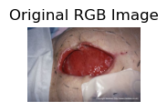
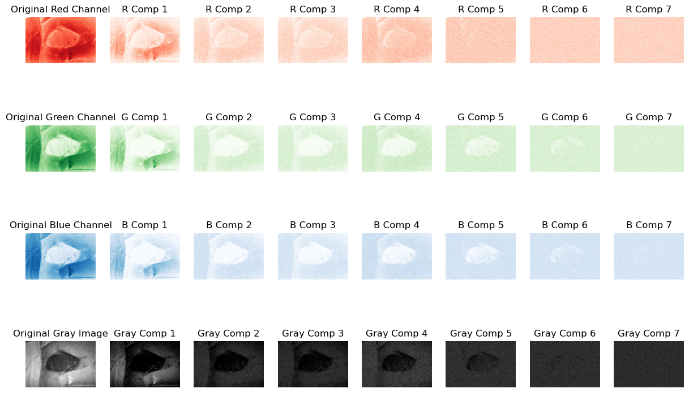

### NMF 的基本原理

對於一個非負的矩陣 \( V \)（比如一幅影像），NMF 旨在找到兩個非負矩陣 \( W \) 和 \( H \)，使得 \( $V \approx W \times H $\)。在這裡：

- \( V \) 是一個 \( $m \times n $\) 的矩陣，代表原始數據（例如，將影像像素以矩陣形式表示）。
- \( W \) 是一個 \( $m \times k $\) 的矩陣，其列代表基底影像。
- \( H \) 是一個 \( $k \times n $\) 的矩陣，其行代表基底影像的權重。

### NMF 在影像處理中的應用

1. **特徵提取**：NMF 可以識別出影像中的重要特徵。例如，在臉部識別應用中，\( W \) 的每一列可以表示臉部的一個特定部分（如眼睛、鼻子等）。

2. **影像壓縮**：通過只保留影像中重要的特徵，NMF 可用於影像壓縮。選擇較小的 \( k \) 值可以減少數據的維度，從而達到壓縮的目的。

3. **影像分割**：NMF 可以幫助識別影像中的不同區域或物體，這對於影像分割來說非常有用。

4. **紋理識別**：NMF 可以用於提取影像的紋理特徵，這對於識別影像中的特定紋理或模式非常有效。

### NMF 的數學計算

NMF 的關鍵在於找到合適的 \( W \) 和 \( H \) 以最小化 \( V \) 和 \( $W \times H$ \) 之間的差異。這通常是通過迭代演算法實現的，如梯度下降或交替最小二乘法。這些演算法逐步調整 \( W \) 和 \( H \) 的值，以減少 \( V \) 和 \( WH \) 之間的差異。

### 實踐注意事項

- **選擇 \( k \) 的值**：\( k \) 的選擇取決於特定應用。較小的 \( k \) 值可能無法捕捉所有重要特徵，而較大的 \( k \) 值則可能導致過度擬合。
- **初始化和收斂**：NMF 的結果可能會因初始化的不同而有所不同，因此可能需要多次嘗試以確保得到最佳結果。
- **計算成本**：NMF 的計算成本可以相對較高，尤其是對於大型數據集。
非負矩陣分解（NMF）是一種矩陣分解技術，用於將非負矩陣分解為兩個或更多非負矩陣的乘積。它在數據挖掘和機器學習中尤其有用，因為許多數據集自然是非負的（如圖像數據、文本數據等）。下面是NMF的數學推理和基本算法。

非負矩陣分解（Non-negative Matrix Factorization, NMF）是一種將矩陣分解成兩個或多個非負矩陣的方法。以下是NMF的完整數學推理過程，使用LaTeX格式表示數學符號。
### NMF的基本問題設定

給定一個非負矩陣 $V \in \mathbb{R}^{m \times n}$，NMF的目標是找到兩個非負矩陣 $W \in \mathbb{R}^{m \times k}$ 和 $H \in \mathbb{R}^{k \times n}$，使得：

$$ V \approx WH $$

這裡 $k$ 是一個小於 $m$ 和 $n$ 的數字，它決定了分解的等級。

### 目標函數和最小化

NMF的目標是最小化 $V$ 和 $WH$ 之間的差異。常用的方法是最小化二者之間的Frobenius範數的平方，即：

$$ \min_{W,H} \ \| V - WH \|_F^2 $$

其中，$$\| A \|_F$$ 表示矩陣 $A$ 的Frobenius範數，計算為：

$$ \| A \|_F = \sqrt{\sum_{i,j} a_{ij}^2} $$

### 約束條件

由於NMF僅允許非負元素，因此 $W$ 和 $H$ 的所有元素都必須非負：

$ w_{ij} \geq 0 \, \forall i,j \quad \text{和} \quad h_{ij} \geq 0 \, \forall i,j $

### 求解方法

NMF的一種常見求解方法是使用交替最小化策略，即固定 $W$ 來更新 $H$，然後固定 $H$ 來更新 $W$，這一過程反覆進行直到收斂。更新步驟通常使用基於梯度下降或其他優化方法的迭代算法。

### 梯度下降更新

例如，可以使用梯度下降法來逐步更新 $W$ 和 $H$。更新公式如下：

$$ H_{\text{new}} = H - \alpha \frac{\partial}{\partial H} \| V - WH \|_F^2 $$

$$ W_{\text{new}} = W - \alpha \frac{\partial}{\partial W} \| V - WH \|_F^2 $$

其中，$\alpha$ 是學習率，決定了每次迭代時更新的步長。

### 最終目標

NMF的終極目標是找到最佳的 $W$ 和 $H$，使得 $V \approx WH$ 同時 $W$ 和 $H$ 的元素都保持非負。這樣的分解使得原始數據 $V$ 被有效地表示為基底矩陣 $W$ 的線性組合，其中 $H$ 提供了這些基底的權重。

以上就是非負矩陣分解的數學推理過程。


```python
import numpy as np
import matplotlib.pyplot as plt
from sklearn.decomposition import NMF
from skimage import data, color, io
from skimage.transform import resize
from PIL import Image, ImageEnhance
import scipy.ndimage
import os
from scipy.ndimage import gaussian_filter, median_filter, uniform_filter
import numpy as np
```


```python
def apply_nmf_to_image_channels(image_path, n_components=16):
    def apply_nmf(image, n_components):
        # 將影像矩陣壓縮成二維
        w, h = image.shape
        image = image.reshape((w * h, 1))

        # 應用NMF
        model = NMF(n_components=n_components, init='random', random_state=0)
        W = model.fit_transform(image)
        H = model.components_

        return W, H, w, h

    # 讀取影像
    image = Image.open(image_path)

    # 顯示原始RGB影像
    plt.figure(figsize=(15, 12))
    plt.subplot(5, n_components + 1, 1)
    plt.imshow(image)
    plt.title('Original RGB Image')
    plt.axis('off')

    # 將PIL影像轉換為numpy數組
    image_np = np.array(image)

    # 提取R、G、B通道
    r_channel = image_np[:, :, 0]
    g_channel = image_np[:, :, 1]
    b_channel = image_np[:, :, 2]

    # 轉換為灰階影像
    gray_image = color.rgb2gray(image_np)

    # 分別對R、G、B、灰階進行NMF
    W_r, H_r, w_r, h_r = apply_nmf(r_channel, n_components=n_components)
    W_g, H_g, w_g, h_g = apply_nmf(g_channel, n_components=n_components)
    W_b, H_b, w_b, h_b = apply_nmf(b_channel, n_components=n_components)
    W_gray, H_gray, w_gray, h_gray = apply_nmf(gray_image, n_components=n_components)


    # 顯示結果
    plt.figure(figsize=(15, 12))

    # 顯示原始R、G、B和灰階通道
    plt.subplot(5, n_components + 1, 1)
    plt.imshow(r_channel, cmap='Reds')
    plt.title('Original Red Channel')
    plt.axis('off')

    plt.subplot(5, n_components + 1, n_components + 2)
    plt.imshow(g_channel, cmap='Greens')
    plt.title('Original Green Channel')
    plt.axis('off')

    plt.subplot(5, n_components + 1, 2 * n_components + 3)
    plt.imshow(b_channel, cmap='Blues')
    plt.title('Original Blue Channel')
    plt.axis('off')

    plt.subplot(5, n_components + 1, 3 * n_components + 4)
    plt.imshow(gray_image, cmap='gray')
    plt.title('Original Gray Image')
    plt.axis('off')

    # 顯示NMF分解組件
    for i in range(n_components):
        plt.subplot(5, n_components + 1, i + 2)
        plt.imshow(W_r[:, i].reshape((w_r, h_r)), cmap='Reds')
        plt.title(f'R Comp {i+1}')
        plt.axis('off')

        plt.subplot(5, n_components + 1, i + n_components + 3)
        plt.imshow(W_g[:, i].reshape((w_g, h_g)), cmap='Greens')
        plt.title(f'G Comp {i+1}')
        plt.axis('off')

        plt.subplot(5, n_components + 1, i + 2 * n_components + 4)
        plt.imshow(W_b[:, i].reshape((w_b, h_b)), cmap='Blues')
        plt.title(f'B Comp {i+1}')
        plt.axis('off')

        plt.subplot(5, n_components + 1, i + 3 * n_components + 5)
        plt.imshow(W_gray[:, i].reshape((w_gray, h_gray)), cmap='gray')
        plt.title(f'Gray Comp {i+1}')
        plt.axis('off')

    plt.show()

# 使用函數示例

```


```python
image_path = r"C:\Users\B20770\Desktop\影像資料\006.wound_dataset_壢新醫院\images\175732.jpg"

apply_nmf_to_image_channels(image_path, n_components=7)
```


    

    


    

    

